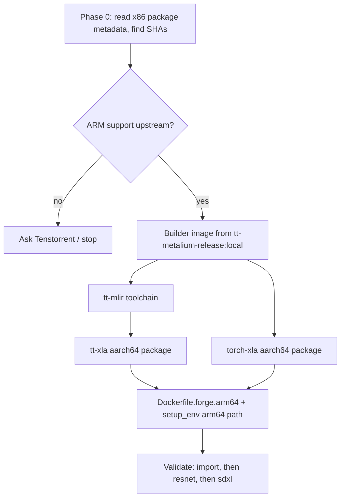

# Plan: ARM64 build of `Dockerfile.forge`

Goal: build an aarch64 version of `tt-media-server/Dockerfile.forge`, using the
locally built ARM tt-metal image `tt-metalium-release:local` as the base.

## Status (2026-09-25)

Exact commands, timings and results are in [`arm64-forge-build-log.md`](arm64-forge-build-log.md).

- **The aarch64 forge image works end to end on a Blackhole.**
  - `tt-media-server-forge:arm64-tt`, built with `--build-arg FORGE_WHEELS=wheels`, serves
    `MODEL_RUNNER=tt-xla-resnet` on device 0.
  - On PyTorch Hub's sample `dog.jpg` (a Samoyed) it returns `Samoyed` at 94%.
  - Warmup takes 104 s and warm requests about 0.4 s.
- **Phase 1.5 done: `torch_xla-2.9.0+gited8a445-cp312-cp312-linux_aarch64.whl`**, from stage
  `torch-xla-wheel`, in about 15 minutes.
  - It's built against the official aarch64 `torch 2.11.0+cpu` wheel instead of a PyTorch source
    build.
  - `Requires-Dist` and the linked libraries match the x86 wheel.
  - PyTorch/XLA ops on device match CPU (PCC 1.0).
- **tt_lang isn't built.** It's only needed for custom tt-lang kernels, which the forge runners
  don't use, so `setup_env.sh` skips it with a warning when no wheel is present.
- Not yet tested on device: sdxl, the LoRA runner and the other CNN runners.

- **Phase 1.3 done: `pjrt_plugin_tt-1.5.0.dev20260812001218-cp312-cp312-linux_aarch64.whl`**
  (plus `vllm_tt`), built by stage `pjrt-wheel` of `Dockerfile.forge-builder.arm64` and exported
  to `tt-media-server/wheels/`.
  - It needs 7 small patches to tt-xla, applied by `scripts/forge_arm64/patch_tt_xla.py`:
    - x86 URL pins become version pins
    - wheel version override
    - aarch64 platform tag
    - bash for `setup.py`'s shell calls
    - host arch in `tt-forge-install`
    - two fixes for building on 22.04 with GCC 12's libstdc++: a `-Wno-error` flag, and `{fmt}`
      instead of `<format>` in one header
  - **It runs on a Blackhole:** `jax.devices("tt")` lists both cards, and a jitted matmul matches
    NumPy.
- **Still missing:** torch-xla (Phase 1.5) and tt_lang. The pjrt wheel's metadata requires both,
  and the forge runners import `torch_xla`.

- **Parallel track done:** `tt-media-server/Dockerfile.forge.arm64` builds on an aarch64 host
  with the default `FORGE_WHEELS=none` (image is about 11 GB). The venv imports torch, diffusers, timm, yolox,
  faster_fifo, av, pycocotools, flax and blacksmith, and `import main` works. `tt-smi` works,
  and `imageio-ffmpeg` ships an aarch64 ffmpeg. `setup_env.sh` has an `aarch64` branch that
  installs `$FORGE_WHEELS_DIR/*.whl` (when present), drops the `tt-forge` pin, and installs
  aarch64 SFPI itself.
- **Phase 1.1 and 1.2 done:** `tt-media-server/Dockerfile.forge-builder.arm64`
  - Stage `builder`: Ubuntu 22.04 with clang-20 and lld, Python 3.12 and bazelisk.
  - Stage `toolchain`: tt-mlir `da6f1ce0`'s `env/` build, installed into
    `/opt/ttmlir-toolchain`. It builds natively on aarch64 with no patches, in about 20 minutes on 80
    cores. Output: `mlir-opt` (LLVM 22.0.0git, aarch64), `flatc` 24.3.25, patched
    StableHLO/Shardy sources, and a Python 3.12 venv (5 GB). The venv already gets the aarch64
    torch 2.9.1 through a platform marker in tt-mlir's own requirements.
  - The builder stays on Ubuntu 22.04 rather than upstream's 24.04, so the resulting libraries
    run on the 22.04 runtime image. The base image only has `ld.lld-20`, so the Dockerfile adds an `ld.lld` symlink.
- **Phase 0 results** (from the x86 wheel metadata plus a read of upstream sources; nothing built yet):
  - Pins: tt-xla `3cfcfcfd`, tt-mlir `da6f1ce0`, tt-metal `5beed318`, SFPI `7.67.0`.
  - `tt-forge` is an empty meta-package. It depends on `pjrt-plugin-tt` and **`vllm_tt`**,
    both as direct x86 URLs. `pjrt-plugin-tt` depends on `torch==2.11.0+cpu`,
    `torch-xla==2.9.0+gited8a445`, `jax/jaxlib==0.7.1` and **`tt_lang==1.1.5.dev20260704+light`**,
    again as direct x86 URLs.
    Two extra packages compared with the table below:
    - `tt_lang` is compiled (it builds its own LLVM/MLIR and tt-metal), so it's a second big build.
    - `vllm_tt` is pure Python and comes from `tt-xla/integrations/vllm_plugin`; it needs
      `vllm==0.26.0`, which has aarch64 builds.
  - Upstream aarch64 builds exist for torch 2.11.0+cpu, jaxlib 0.7.1 and vllm 0.26.0. There are
    **zero** aarch64 packages on `pypi.eng.aws.tenstorrent.com` for pjrt-plugin-tt, torch-xla,
    tt-lang or vllm-tt.
  - `tt-forge-install` is just an SFPI installer, and it hardcodes `sfpi_arch = "x86_64"`.
    SFPI 7.67.0 does publish an `aarch64_debian` .deb; `setup_env.sh` now installs it and
    checks its hash.
  - **Phase 1.4 is out:** the base image's ttnn is `0.75.0rc10+gd04395ed862`, not `5beed318`,
    and it has SFPI 7.72.0.
  - The base image activates a Python 3.10 venv at `/opt/venv` through `PATH` and `VIRTUAL_ENV`;
    the arm64 Dockerfile resets both.
  - tt-mlir needs clang 20 or newer for the runtime build (use apt.llvm.org on 22.04), and its
    docs only list 24.04 as supported. On non-x86 it turns off tt-metal's distributed/MPI
    support (`third_party/CMakeLists.txt:138-143`), so there's **no multi-host on ARM**.
  - More x86 pins in tt-xla to patch in Phase 1:
    - the direct URLs in `python_package/requirements.txt`
    - `setup.py` platform tag detection
    - the Bazel x86 installer in `scripts/build_torch_xla.sh` (use bazelisk instead)
  - torch-xla (Bazel/XLA) on aarch64 is still the biggest unknown: upstream has no ARM CI.
- Without the wheels, packages aren't constrained by pjrt-plugin-tt's pins, so the image
  resolves newer versions (torch 2.14, jax 0.11, transformers 5.17). Once local wheels are
  installed, their metadata brings back the x86 image's versions.

## The main blocker

Almost all of the Dockerfile ports easily. The hard part is
`tt_model_runners/forge_runners/setup_env.sh`: it runs
`pip install tt-forge==1.5.0.dev20260812001218`. On the Tenstorrent package index
(`https://pypi.eng.aws.tenstorrent.com`), the three packages the forge runners need
have **no aarch64 builds**:

| Package | Available builds | Used by |
|---|---|---|
| `tt-forge` | x86_64 only (`cp312-linux_x86_64`) | the pin in `forge_runners/requirements.txt` |
| `pjrt-plugin-tt` (tt-xla) | x86_64 only (`manylinux_2_34_x86_64`) | the TT device backend |
| `torch-xla` (Tenstorrent fork) | x86_64 only | `forge_runner.py`, `sdxl_forge_runner.py` and `lora_single_chip_runner.py` all import `torch_xla` |

On arm64, pip will just fail with "no matching distribution".

**The `tt-metalium-release:local` image mostly doesn't help with this.** The forge
image doesn't use the base image's tt-metal. `TT_METAL_HOME` points to
`venv-worker/lib/python3.12/site-packages/pjrt_plugin_tt/tt-metal`, a copy of
tt-metal bundled inside the `pjrt-plugin-tt` package. tt-mlir pins that copy to a
specific commit. The base image is still useful as the Ubuntu 22.04 base and for
the host-side runtime pieces. You could also try reusing its tt-metal (see Phase
1.4), but only if the commit matches exactly.

## Phase 0: Check feasibility (about a day, do this first)

1. **Find the exact commits.** Download the x86 packages without installing them
   and read their metadata:
   ```sh
   pip download --no-deps --platform manylinux_2_34_x86_64 --python-version 3.12 \
     --extra-index-url https://pypi.eng.aws.tenstorrent.com \
     tt-forge==1.5.0.dev20260812001218 pjrt-plugin-tt==1.5.0.dev20260812001218
   ```
   From the `METADATA` / `RECORD` files, record:
   - `tt-forge`'s dependencies (probably `pjrt-plugin-tt`, `torch-xla` and a
     specific `torch` version, plus `jax`)
   - the tt-xla git SHA, and from it the tt-mlir SHA, and from that the tt-metal SHA
   - what the `tt-forge-install` script does (it installs system deps, and they
     may be x86-specific)
2. **Check ARM support upstream** in `tenstorrent/tt-xla`, `tenstorrent/tt-mlir`
   and `tenstorrent/pytorch-xla`: look for `aarch64` in the toolchain/CMake files
   and in open issues. tt-metal clearly builds on ARM (`tt-metalium-release:local`
   exists). tt-mlir's LLVM toolchain should too. torch-xla (a Bazel build) is the
   most likely source of pain.
3. **Decide on the build host.** Build natively on an ARM machine. LLVM, tt-mlir
   and Bazel builds under QEMU emulation would take days.

If Phase 0 shows that tt-xla or torch-xla can't be built for aarch64, stop there
and ask Tenstorrent. Everything after this depends on those packages.

## Phase 1: Build the missing packages for aarch64 (the bulk of the work)

Build these once, outside the final image, in a separate builder container. Save
the results to a `wheels/` folder.

1. **Builder image:** start from `tt-metalium-release:local`. A "release" image
   probably lacks build tools, so add clang (the version tt-mlir expects, likely 17
   or 20), ninja, ccache, Bazel/bazelisk, and a Python 3.12 dev environment.
2. **tt-mlir toolchain:** build tt-mlir's pinned LLVM/MLIR into
   `TTMLIR_TOOLCHAIN_DIR` (`env/` build). This takes hours.
3. **tt-xla:** at the pinned SHA, build `pjrt_plugin_tt.so` and package it as
   `pjrt_plugin_tt-*-linux_aarch64.whl`. This builds tt-mlir and the bundled
   tt-metal. Also package `torch_plugin_tt` / `jax_plugin_tt` if tt-forge depends
   on them.
4. **Optional: reuse your tt-metal.** If your tt-metal commit matches the one
   tt-mlir pins, you could point tt-mlir at it, or set `TT_METAL_RUNTIME_ROOT` at
   runtime. `pjrt_plugin_tt/__init__.py` respects that variable. Don't count on
   this.
5. **torch-xla:** build Tenstorrent's fork at the matching commit, against a
   `torch` aarch64 package of the same version. PyTorch publishes aarch64 CPU
   builds.
6. **tt-forge:** either rebuild it with the same metadata, or drop it and pin its
   dependencies directly.

## Phase 2: New `tt-media-server/Dockerfile.forge.arm64`

Starting from `Dockerfile.forge`, these are the changes:

| Line / area | Change |
|---|---|
| `FROM ...ubuntu-22.04-dev-amd64` | `ARG BASE_IMAGE=tt-metalium-release:local` then `FROM ${BASE_IMAGE}` |
| Kitware apt repo (`focal`) | Remove it. It's wrong for 22.04 anyway, and the pip `cmake` install below already covers CMake. |
| `apt-get install` list | Should work as is. `software-properties-common` may be missing from a release image; `add-apt-repository` needs it. |
| deadsnakes PPA for Python 3.12 | Deadsnakes should publish arm64 builds for jammy; confirm with a test build |
| `cmake-3.26.4-linux-x86_64.sh` | Use `cmake-3.26.4-linux-$(uname -m).sh`, since Kitware ships an `aarch64` installer. Or delete this step and rely on `pip install cmake`. |
| Rust + `tt-smi` | Works on aarch64. `pyluwen` compiles from source, which is why the protobuf/Rust deps are there. |
| New step | `COPY wheels/ /wheels/` |
| `setup_env.sh` | Add an arm64 path, e.g. `pip install --find-links /wheels ...`, with a `requirements-arm64.txt` that replaces the `tt-forge==` pin with your local builds. Skip or adapt `tt-forge-install`. Keep the change small, e.g. switch on `uname -m`. |
| `TT_METAL_HOME` | Leave it unchanged if your package keeps the same `pjrt_plugin_tt/tt-metal` layout |
| `scripts/build_merge_venv.py` | No change needed; it installs pure-Python/CPU torch packages |

**Other Python dependencies to check on arm64** (most have aarch64 builds, but
verify):

- Built from source, so they need the compilers already in the image:
  `faster_fifo`, `yolox==0.3.0` (sdist, built without isolation, needs torch
  already installed), `pycocotools`, `thop`
- Watch these: `imageio-ffmpeg` (bundles an ffmpeg binary, so check it has an
  aarch64 build), `av==17.0.1`, `jax`/`jaxlib` (pulled in by `flax`; must match
  the version `jax_plugin_tt` expects)
- `blacksmith @ git+...`: check its pinned dependencies

## Phase 3: Validation, step by step

1. Build from the repo root (the Dockerfile copies `tt-media-server` and
   `tt-vllm-plugin/`):
   ```sh
   docker build --platform linux/arm64 \
     -f tt-media-server/Dockerfile.forge.arm64 \
     -t tt-media-server-forge:arm64 .
   ```
2. **Without a device:**
   ```sh
   python -c "import torch, torch_xla, pjrt_plugin_tt"
   tt-smi --help
   ```
3. **With a device** (`--device /dev/tenstorrent`, hugepages mount):
   - `xr.set_device_type("TT"); xm.xla_device()`
   - `MODEL_RUNNER=tt-xla-resnet` and the `/v1/cnn/search-image` curl from
     `tt_model_runners/forge_runners/README.md`
4. Then `tt-xla-sdxl` and the LoRA runner.

## Suggested order



## Shortcut to run in parallel

Write `Dockerfile.forge.arm64` now with the tt-forge install behind a build
argument (e.g. `ARG FORGE_WHEELS=none`). That lets you fix every other arm64
problem (apt, Python 3.12, CMake, Rust/tt-smi, the other dependencies, the merge
venv) while the compiler builds run. `sdxl_forge_runner.py` already has a CPU
path, which is useful for testing the server without a device.
